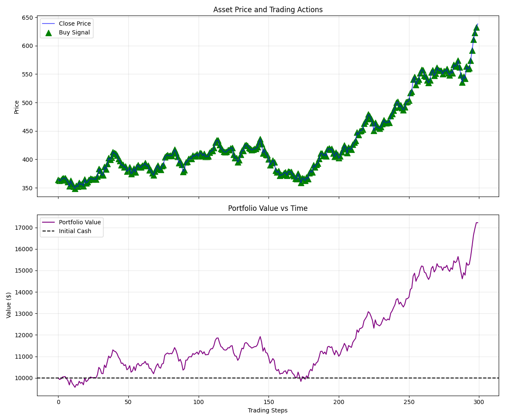

# TradeMind-AI 🚀
TradeMind AI is a powerful, intelligent trading assistant platform with a futuristic, AI-themed user interface. It provides real-time market data, portfolio tracking, and AI-driven insights to help traders make informed decisions.

## ✨ Key Features
- **Real-Time Market Tracking**: Live crypto prices via Binance WebSockets and stock prices via Alpha Vantage.
- **Interactive Technical Charts**: Historical price data visualization for over 10,000+ symbols.
- **Smart Dashboard**: Real-time portfolio valuation and P&L tracking (simulated).
- **AI Insights**: Automated market trend analysis and risk alerts.
- **AI Assistant**: Conversational interface for trading education and strategy advice.

## 🧠 Reinforcement Learning Trading Agent

**Algorithm:**
PPO (Stable-Baselines3)

**Features:**
- Custom Gym trading environment
- Technical indicators (RSI, MACD)
- RL agent training pipeline
- Portfolio evaluation metrics

**Performance Plots:**

## 🛠️ Technical Stack
- **Frontend**: HTML5, Vanilla CSS3 (Custom Design System), JavaScript (ES6+).
- **Backend**: Python 3.10+, FastAPI, Uvicorn (Asynchronous Server).
- **Data Processing**: Pandas, Technical Analysis Library (`ta`).
- **Charts**: [Chart.js](https://www.chartjs.org/) for high-performance visualizations.
- **Live Data**: 
  - **Crypto**: Binance WebSockets & Local Backend WebSocket.
  - **Stocks/Indices**: Alpha Vantage REST API.
- **Design**: Futuristic "Glassmorphism" UI with neon accents.

## 🚀 Getting Started

### Backend Setup
1. Navigate to the project root.
2. Install dependencies: `pip install -r requirements.txt`
3. Run the backend server: `uvicorn backend.app.main:app --reload`
4. The backend will be available at `http://localhost:8000`.

### RL Training & Evaluation
- **Train Agent**: `python main.py --mode train`
- **Evaluate Agent**: `python main.py --mode evaluate`
- Models are saved in `models/` and plots in `evaluation_plots.png`.

### Frontend Setup
1. Open `frontend/index.html` in your browser.
2. Sign up or log in to access the dashboard.
3. **API Setup**: Update the API key in `frontend/scripts/market-service.js` or via `localStorage`.

## 🤖 Architecture
The project follows a modern modular full-stack architecture:

- **Frontend (`/frontend`)**:
  - `scripts/market-service.js`: Unified service for WebSocket and API fallback.
  - HTML files: `dashboard.html`, `assistant.html`, `markets.html`, etc.
- **Backend (`/backend`)**:
  - `app/`: FastAPI application (`main.py`) and business services (`services.py`).
  - `core/`: Reinforcement learning agent logic and trading environment.
  - `data/`: Data loading and CSV management.
  - `indicators/`: Technical indicator calculations.
  - `utils/`: Common Python utilities.
- **Data & Models**:
  - `/data`: Historical stock data (e.g., `sample_data.csv`).
  - `/models`: Saved RL agent model artifacts.
- **Config**: `/configs/config.yaml` manages system-wide parameters.

---
*Disclaimer: TradeMind AI is for educational and experimental purposes. Always practice risk management when trading live markets.*
